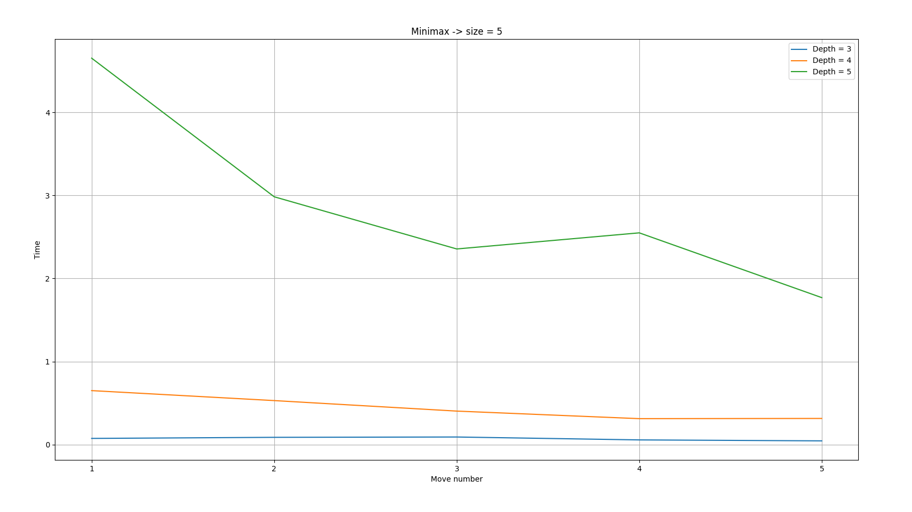
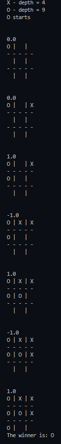
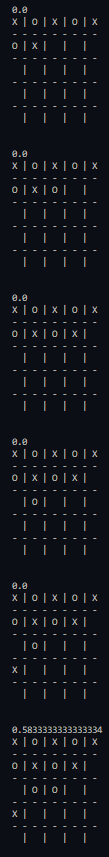

# Min-max algorithm for tic-tac-toe

## Table of contents
* [General info](#general-info)
* [Technologies](#technologies)
* [Results](#results)
* [Setup](#setup)

## General info
This project is an implementation of min-max algorithm with alpha-beta for tic-tac-toe. User can choose the size of board. The deapth of algorithm can be selected too.

FIle `play.py` contains function which allows to play the game with algorithm or watch simulaton of two bots playing.

File `tic_tac_toe.py` contains the body of algorithm.

File `Min-max_sprawozdanie.pdf` contains repot of my experiments on this implementation writen in Polish.

### Players

This class sets possition of player base on his input and also store his symbol.

### State

This class represent game state and calculate value of it by couting same symbols in one line. It is also used for drawing tha state.

### Game

This class is used for storing game state and making move base on algorithm or user input.

### Minimax_alg

It is a class of min-max which contains algorithm with heuristic created base of state value calculated in class State.
	
## Technologies
Project is created with library:
* copy

## Results

	
## Setup
To run this project, you can run `play.py` file and choose the version and params of algoritm you want to see.
